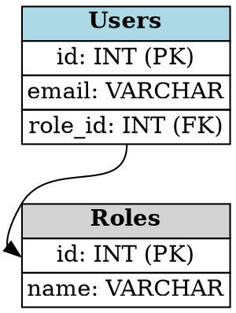
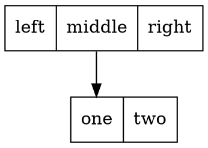
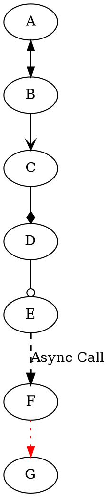
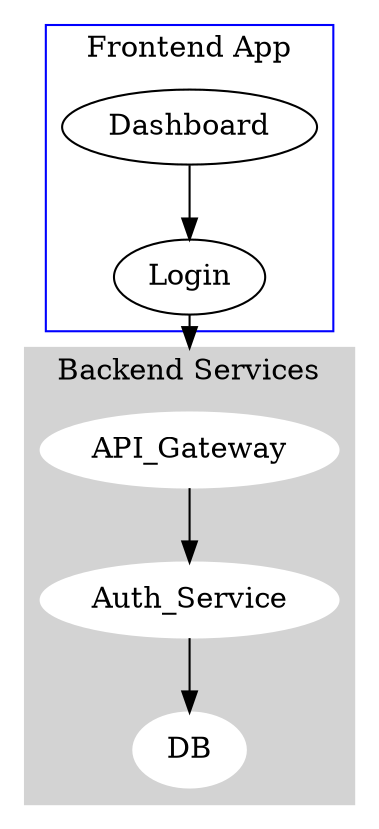

# Graphviz (DOT) 深度语法参考手册 (Expert Guide)

Graphviz 使用 DOT 语言描述图形结构，擅长自动计算复杂节点的最佳布局。对于架构图、数据库关系图和状态机，它是最佳选择。

## 🗺️ 引擎与布局索引 (Layout Engines)

AI 应根据图形特征选择 `layout` 属性（默认是 `dot`）。

| 引擎 | 适用场景 | 布局特点 |
| :--- | :--- | :--- |
| **`dot`** | **有向图**、层级结构 | 节点分层排列，减少交叉边，适合流程图/树。 |
| **`neato`** | **无向图**、网络拓扑 | 基于弹簧模型，节点均匀分布，适合网状结构。 |
| **`fdp`** | **无向图**、聚类 | 类似 neato 但支持 cluster。 |
| **`circo`** | **环形结构** | 节点排列在同心圆上。 |

---

## 🎨 全局配置与样式 (Global Attributes)

在 `digraph` 开头定义的属性会应用到全局。

```graphviz
digraph Architecture {
    // === 布局控制 ===
    rankdir=LR;          // 方向: LR (左->右), TB (上->下)
    splines=ortho;       // 连线风格: ortho (折线), spline (曲线), line (直线)
    nodesep=0.8;         // 同层节点间距
    ranksep=1.2;         // 层级间距
    fontname="Helvetica"; // 全局字体

    // === 默认样式 ===
    node [shape=box, style="filled,rounded", color="#999999", fillcolor="#f9f9f9", fontname="Helvetica"];
    edge [fontname="Helvetica", color="#666666", arrowsize=0.8];

    // === 定义层级 (强制对齐) ===
    { rank=same; NodeA; NodeB; } // 将 NodeA 和 NodeB 强制放在同一层
}
```

---

## 🧩 高级节点类型 (Advanced Nodes)

### 1. HTML 类表格节点 (Record-based HTML)
Graphviz 的杀手锏。使用 HTML 表格语法定义复杂的节点结构（如数据库表、UML类）。

*   **注意**：`label` 必须用 `<...>` 包裹，而非双引号。

### 2. 传统 Record 节点
旧式语法，不如 HTML 灵活，但写起来简单。使用 `|` 分隔列，使用 `{...}` 嵌套行。

---

## 🔗 边与关系 (Edges)

### 3.1 箭头与样式

---

## 📦 子图与聚类 (Subgraphs & Clusters)

**必须以 `cluster_` 开头**，否则只作为逻辑分组而不显示边框。

