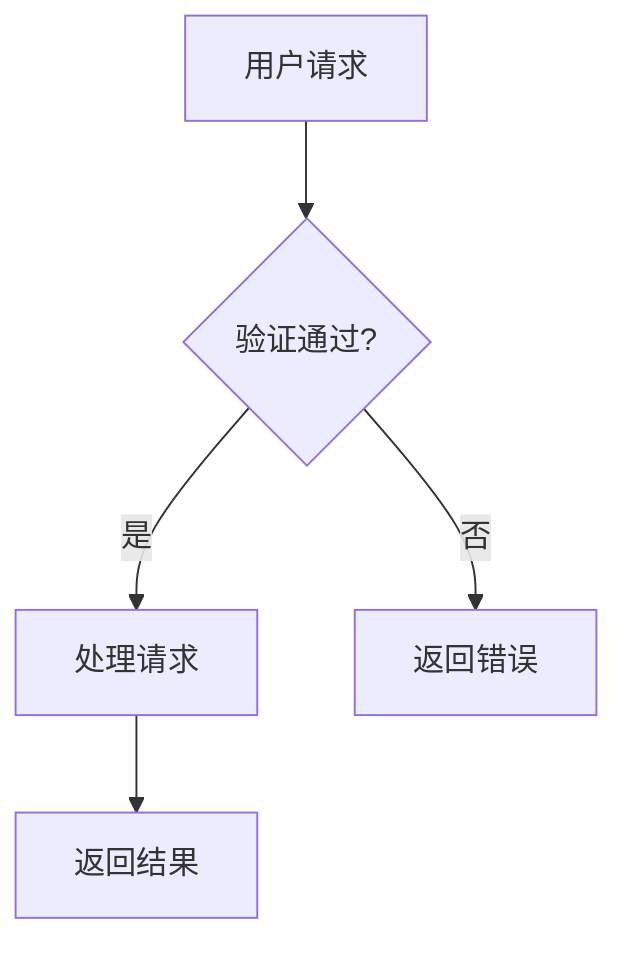
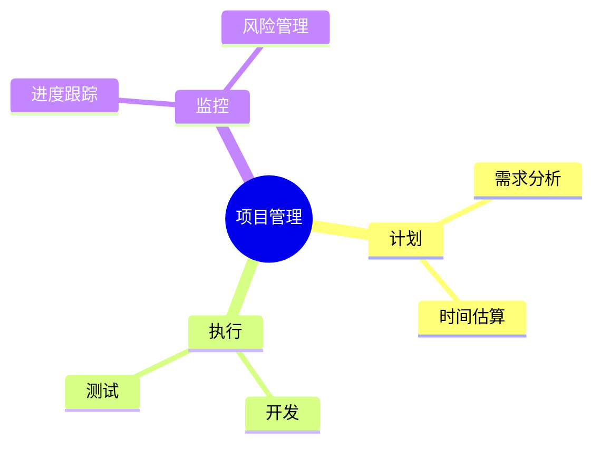
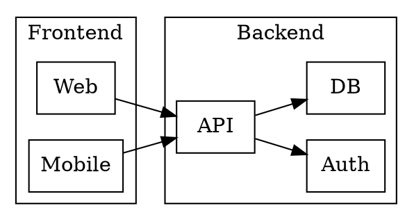

# Obsidian 图表代码块生成 (Chart Code Block Generator)

## 🎯 这个 Skill 是什么？

在 **Obsidian 笔记**中，用户可以通过特定的代码块语法嵌入图表。**Editor Pro 插件**会自动渲染这些代码块为可视化图表。

**你的任务**：当用户在编辑 Markdown 笔记时需要图表，**直接在笔记文件中写入**对应的代码块。代码块写入后，Obsidian 会自动渲染为可视化图表。

### 使用场景

- 用户正在编辑一个 `.md` 文件，要求"画个流程图"
- 用户给了一些数据，要求"可视化展示"
- 用户要求在笔记中添加图表

**操作方式**：使用 `write_to_file` 或 `replace_file_content` 工具将代码块写入用户的笔记文件。

### 支持的代码块语法

| 语法 | 引擎 | 典型用途 |
|-----|------|---------|
| ` ```mermaid ` | Mermaid | 流程图、时序图、类图、思维导图、甘特图 |
| ` ```echarts ` | ECharts | 柱状图、折线图、饼图、热力图、仪表盘 |
| ` ```graphviz ` 或 ` ```dot ` | Graphviz | 复杂网络拓扑、状态机、DOT 语言 |
| ` ```vega-lite ` 或 ` ```vegalite ` | Vega-Lite | 统计分析、数据探索、声明式图表 |
| ` ```infographic ` | Infographic | 信息卡片、Banner、时间线 |

---

## ⚡ 工作流程 (4 步)

### Step 1: 理解用户意图

> **💡 写作场景优先使用 Infographic！**
> Infographic 是专为写作场景设计的信息图引擎，200+ 精美模板，零配置即可生成专业信息图。
> 相比 ECharts/Mermaid，Infographic 更适合**笔记、文章、文档**场景。

| 用户想要... | **首选引擎** | 备选 |
|------------|-------------|------|
| 展示**步骤/流程** | **🌟 Infographic** (`sequence-steps-simple`) | Mermaid |
| 展示**时间线/历史** | **🌟 Infographic** (`sequence-timeline-simple`) | Mermaid |
| 展示**功能清单/要点** | **🌟 Infographic** (`list-grid-compact-card`) | - |
| 展示**组织结构/层级** | **🌟 Infographic** (`hierarchy-tree-tech-style-rounded-rect-node`) | Mermaid |
| 展示**四象限/对比** | **🌟 Infographic** (`quadrant-quarter-simple-card`) | - |
| 展示**简单数据对比** | **🌟 Infographic** (`chart-column-simple`) | ECharts |
| 展示**复杂流程/架构** | Mermaid/Graphviz | - |
| 展示**交互式图表/大数据** | ECharts | Vega-Lite |
| 展示**统计分析** | Vega-Lite | ECharts |

### Step 2: 查阅语法参考 (CRITICAL!)

> ⚠️ **不要猜测语法！** 必须使用 `view_file` 工具读取对应的参考文档。

| 引擎 | 参考文档路径 | 核心内容 |
|-----|-------------|---------|
| **🌟 Infographic** | `.agent/skills/obsidian-chart-blocks/reference/infographic.md` | **200+ 模板**, lists, sequences, hierarchy, compare, chart |
| **Mermaid** | `.agent/skills/obsidian-chart-blocks/reference/mermaid.md` | flowchart, sequenceDiagram, classDiagram, mindmap, gantt |
| **ECharts** | `.agent/skills/obsidian-chart-blocks/reference/echarts.md` | bar, line, pie, scatter, heatmap, radar, dataset |
| **Graphviz** | `.agent/skills/obsidian-chart-blocks/reference/graphviz.md` | digraph, subgraph, cluster, layout engines |
| **Vega-Lite** | `.agent/skills/obsidian-chart-blocks/reference/vegalite.md` | $schema, data, mark, encoding, transform |

### Step 3: 构建代码

- **Infographic**: 使用简洁的 DSL 语法，2 空格缩进
- **ECharts / Vega-Lite**: 必须是**合法 JSON**（无尾随逗号，属性名双引号）
- **Mermaid / Graphviz**: 使用各自的 DSL 语法
- **背景透明**: ECharts 建议 `"backgroundColor": "transparent"` 适配明暗主题

### Step 4: 写入笔记文件

使用 `write_to_file` 或 `replace_file_content` 工具直接将代码块写入用户的笔记文件。

---

## 📝 各引擎快速示例

### 🌟 1. Infographic 步骤流程（推荐！）

````markdown
```infographic
infographic list-row-simple-horizontal-arrow
data
  items
    - label 下载
      desc 获取安装包
    - label 安装
      desc 运行安装程序
    - label 配置
      desc 完成初始设置
```
````

### 🌟 2. Infographic 时间线

````markdown
```infographic
infographic sequence-timeline-simple
data
  items
    - label 2024-01
      desc 项目启动
    - label 2024-03
      desc 原型完成
    - label 2024-06
      desc 正式发布
```
````

### 🌟 3. Infographic 功能清单

````markdown
```infographic
infographic list-grid-compact-card
data
  items
    - label 智能输入
      desc 自动补全
    - label 图表渲染
      desc 多种图表
    - label 快捷键
      desc 高效编辑
```
````

### 🌟 4. Infographic 四象限

````markdown
```infographic
infographic quadrant-quarter-simple-card
data
  items
    - label 紧急且重要
      desc 立即处理
    - label 重要不紧急
      desc 计划安排
    - label 紧急不重要
      desc 委托他人
    - label 不紧急不重要
      desc 考虑删除
```
````

### 5. Mermaid 流程图

````markdown

````

### 6. Mermaid 思维导图

````markdown

````

### 7. ECharts 柱状图

````markdown
```echarts
{
  "backgroundColor": "transparent",
  "xAxis": { "type": "category", "data": ["Q1", "Q2", "Q3", "Q4"] },
  "yAxis": { "type": "value" },
  "series": [{
    "type": "bar",
    "data": [120, 200, 150, 80],
    "itemStyle": { "color": "#5470c6" }
  }]
}
```
````

### 8. ECharts 饼图

````markdown
```echarts
{
  "backgroundColor": "transparent",
  "tooltip": { "trigger": "item" },
  "series": [{
    "type": "pie",
    "radius": "50%",
    "data": [
      { "value": 1048, "name": "搜索引擎" },
      { "value": 735, "name": "直接访问" },
      { "value": 580, "name": "邮件营销" }
    ]
  }]
}
```
````

### 9. Vega-Lite 柱状图

````markdown
```vegalite
{
  "$schema": "https://vega.github.io/schema/vega-lite/v6.json",
  "data": {
    "values": [
      {"category": "A", "value": 28},
      {"category": "B", "value": 55},
      {"category": "C", "value": 43}
    ]
  },
  "mark": "bar",
  "encoding": {
    "x": {"field": "category", "type": "nominal"},
    "y": {"field": "value", "type": "quantitative"}
  }
}
```
````

### 10. Graphviz 架构图

````markdown

````

### 🌟 11. Infographic 组织架构

````markdown
```infographic
infographic hierarchy-tree-tech-style-rounded-rect-node
data
  title 研发中心
  root
    label CTO
    children
      - label 前端组
      - label 后端组
      - label 测试组
```
````

---

## ⚠️ 常见错误与排查

| 问题 | 原因 | 解决方案 |
|-----|-----|---------|
| **ECharts 空白** | JSON 格式错误（尾随逗号、单引号） | 检查 JSON 合法性 |
| **Mermaid 渲染失败** | 节点 ID 含特殊字符/空格 | 用引号包裹: `A["中文节点"]` |
| **Vega-Lite 不渲染** | 用户未开启设置 / 需重启 | 检查 Editor Pro 设置 → 可视化 → 开启 Vega-Lite |
| **颜色在暗色主题下不可见** | 硬编码浅色背景 | 使用 `"backgroundColor": "transparent"` |
| **ECharts 数据太多挤成一团** | 缺少 dataZoom | 数据 >20 条时添加 `"dataZoom": [{"type": "slider"}]` |

---

## 🎨 主题适配建议

插件会自动检测 Obsidian 主题（明/暗）。建议：

- **ECharts**: `"backgroundColor": "transparent"`，文字颜色使用默认或高对比度
- **Mermaid**: 使用 `%%{init: {'theme': 'neutral'}}%%` 配置主题
- **Vega-Lite**: 插件自动处理 `theme: 'dark'`

---

## 📚 深度参考文档

当需要更复杂的图表配置时，**必须**使用 `view_file` 阅读以下文档：

- **Mermaid 全量语法**: `.agent/skills/obsidian-chart-blocks/reference/mermaid.md`
  - 包含: 10+ 图表类型、节点形状、连线样式、子图、样式类、init 配置
- **ECharts 高级配置**: `.agent/skills/obsidian-chart-blocks/reference/echarts.md`
  - 包含: 组件索引、双Y轴、dataZoom、visualMap、热力图、dataset
- **Graphviz DOT 语法**: `.agent/skills/obsidian-chart-blocks/reference/graphviz.md`
  - 包含: 布局引擎、cluster、HTML 标签、rankdir
- **Vega-Lite 声明式语法**: `.agent/skills/obsidian-chart-blocks/reference/vegalite.md`
  - 包含: transform、layer、facet、brushing
- **Infographic DSL**: `.agent/skills/obsidian-chart-blocks/reference/infographic.md`
  - 包含: banner、timeline、steps、column

---

> **记住**: 当用户需要图表时，**直接在用户的笔记文件中写入代码块**（使用 `write_to_file` 或 `replace_file_content` 工具）。写入后 Obsidian 会自动渲染图表。
