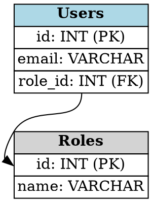
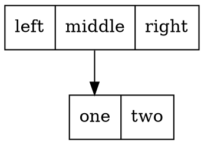
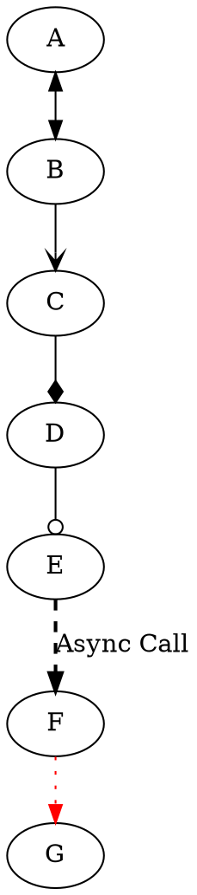
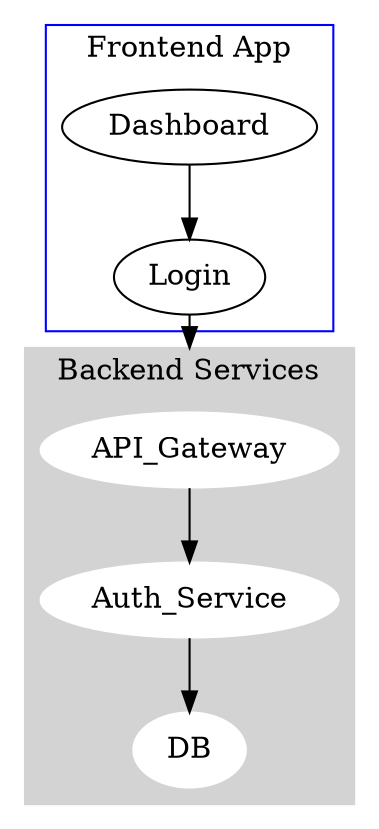

# Graphviz (DOT) 深度语法å‚考手册 (Expert Guide)

Graphviz 使用 DOT 语言æ述图形结æ„，擅长自动计算å¤æ‚节点的最佳布局。对äºæ¶æ„图ã€æ•°æ®åº“关系图和状æ€æœºï¼Œå®ƒæ˜¯æœ€ä½³é€‰æ‹©ã€‚

## ğŸ—ºï¸ å¼•æ“ä¸å¸ƒå±€ç´¢å¼• (Layout Engines)

AI 应根æ®å›¾å½¢ç‰¹å¾é€‰æ‹© `layout` å±æ€§ï¼ˆé»˜è®¤æ˜¯ `dot`）。

| å¼•æ“ | 适用场景 | 布局特点 |
| :--- | :--- | :--- |
| **`dot`** | **有å‘图**ã€å±‚çº§ç»“æ„ | 节点分层æ’列，å‡å°‘交å‰è¾¹ï¼Œé€‚åˆæµç¨‹å›¾/树。 |
| **`neato`** | **æ— å‘图**ã€ç½‘络拓扑 | 基äºå¼¹ç°§æ¨¡å‹ï¼ŒèŠ‚点å‡åŒ€åˆ†å¸ƒï¼Œé€‚åˆç½‘状结æ„。 |
| **`fdp`** | **æ— å‘图**ã€èšç±» | 类似 neato ä½†æ”¯æŒ cluster。 |
| **`circo`** | **ç¯å½¢ç»“æ„** | 节点æ’列在åŒå¿ƒåœ†ä¸Šã€‚ |

---

## 🨠全局é…ç½®ä¸æ ·å¼ (Global Attributes)

在 `digraph` 开头定义的å±æ€§ä¼šåº”用到全局。

```graphviz
digraph Architecture {
    // === 布局æ§åˆ¶ ===
    rankdir=LR;          // æ–¹å‘: LR (å·¦->å³), TB (上->下)
    splines=ortho;       // è¿çº¿é£æ ¼: ortho (折线), spline (曲线), line (直线)
    nodesep=0.8;         // åŒå±‚节点间è·
    ranksep=1.2;         // 层级间è·
    fontname="Helvetica"; // 全局字体

    // === é»˜è®¤æ ·å¼ ===
    node [shape=box, style="filled,rounded", color="#999999", fillcolor="#f9f9f9", fontname="Helvetica"];
    edge [fontname="Helvetica", color="#666666", arrowsize=0.8];

    // === 定义层级 (强制对é½) ===
    { rank=same; NodeA; NodeB; } // å°† NodeA å’Œ NodeB 强制放在åŒä¸€å±‚
}
```

---

## 🧩 é«˜çº§èŠ‚ç‚¹ç±»å‹ (Advanced Nodes)

### 1. HTML 类表格节点 (Record-based HTML)
Graphviz çš„æ€æ‰‹é”。使用 HTML 表格语法定义å¤æ‚的节点结æ„（如数æ®åº“表ã€UML类）。

*   **注æ„**：`label` 必须用 `<...>` 包裹，而éåŒå¼•å·ã€‚

```graphviz
digraph Database {
    node [shape=plain]; // 必须设为 plain æ‰èƒ½ç”¨ HTML

    UserTable [label=<
        <table border="0" cellborder="1" cellspacing="0">
            <tr><td bgcolor="lightblue"><b>Users</b></td></tr>
            <tr><td port="id">id: INT (PK)</td></tr>
            <tr><td port="email">email: VARCHAR</td></tr>
            <tr><td port="role_id">role_id: INT (FK)</td></tr>
        </table>
    >];

    RoleTable [label=<
        <table border="0" cellborder="1" cellspacing="0">
            <tr><td bgcolor="lightgrey"><b>Roles</b></td></tr>
            <tr><td port="id">id: INT (PK)</td></tr>
            <tr><td>name: VARCHAR</td></tr>
        </table>
    >];

    // è¿æ¥å…·ä½“ç«¯å£ (Port)
    UserTable:role_id -> RoleTable:id;
}
```

### 2. 传统 Record 节点
æ—§å¼è¯­æ³•ï¼Œä¸å¦‚ HTML çµæ´»ï¼Œä½†å†™èµ·æ¥ç®€å•ã€‚使用 `|` 分隔列，使用 `{...}` 嵌套行。

```graphviz
digraph Structs {
    node [shape=record];
    struct1 [label="<f0> left|<f1> mid\dle|<f2> right"];
    struct2 [label="<f0> one|<f1> two"];
    
    struct1:f1 -> struct2:f0;
}
```

---

## 🔗 è¾¹ä¸å…³ç³» (Edges)

### 3.1 箭头ä¸æ ·å¼

```graphviz
digraph Edges {
    A -> B [dir=both];              // åŒå‘箭头
    B -> C [arrowhead=open];        // 开放箭头
    C -> D [arrowhead=diamond];     // è±å½¢ç®­å¤´ (èšåˆå…³ç³»)
    D -> E [arrowhead=odot];        // 圆圈
    
    // å¤åˆæ ·å¼
    E -> F [style=dashed, penwidth=2, label="Async Call"];
    F -> G [style=dotted, color="red"];
}
```

---

## 📦 å­å›¾ä¸èšç±» (Subgraphs & Clusters)

**必须以 `cluster_` 开头**，å¦åˆ™åªä½œä¸ºé€»è¾‘分组而ä¸æ˜¾ç¤ºè¾¹æ¡†ã€‚

```graphviz
digraph G {
    compound=true; // å…许è¿çº¿è¿æ¥å­å›¾è¾¹ç•Œ

    subgraph cluster_backend {
        label="Backend Services";
        style=filled;
        color=lightgrey;
        node [style=filled, color=white];
        
        API_Gateway -> Auth_Service;
        Auth_Service -> DB;
    }

    subgraph cluster_frontend {
        label="Frontend App";
        color=blue;
        
        Dashboard -> Login;
    }

    // è·¨å­å›¾è¿æ¥
    Login -> API_Gateway [lhead=cluster_backend]; // lhead需é…åˆ compound=true
}
```
