# Mermaid 深度语法参考手册 (Expert Guide)

本手册涵盖 Mermaid 的全量语法与高级特性。AI 在生成图表时，应优先查阅此文档以获取最佳实践。

## 🗺️ 官方图表索引 (Chart Index)

| 类型 | 关键词 | 用途 | 关键特性 |
| :--- | :--- | :--- | :--- |
| **流程图** | `graph` / `flowchart` | 逻辑步骤、决策树 | 子图、多形状节点、样式类 |
| **时序图** | `sequenceDiagram` | 交互时序、API调用 | 激活块、并发(par)、循环(loop) |
| **类图** | `classDiagram` | OOP 架构设计 | 继承/组合关系、方法可见性 |
| **状态图** | `stateDiagram-v2` | 状态机、生命周期 | 复合状态、并发状态 |
| **实体关系图** | `erDiagram` | 数据库建模 | 1:1, 1:N, M:N 关系符号 |
| **甘特图** | `gantt` | 项目进度管理 | 日期排除、依赖关系 |
| **饼图** | `pie` | 简单占比统计 | 简单键值对 |
| **思维导图** | `mindmap` | 头脑风暴、层级结构 | 缩进语法、图标支持 |
| **Git图** | `gitGraph` | 版本分支管理 | commit, branch, merge, checkout |
| **象限图** | `quadrantChart` | 四象限分析 | x/y 轴标签、点位分布 |
| **时间轴** | `timeline` | 历史事件流 | 简单的时间-事件映射 |

---

## 🛡️ 最佳实践规范 (Best Practices)

### 1. ID 命名规范
*   **安全字符**：节点 ID 仅使用英文字母、数字和下划线（如 `Node_A`）。
*   **显示文本**：将显示文本放在 `[]`, `()` 等括号中。
    *   ✅ `A[开始 Process]`
    *   ❌ `开始 Process --> 结束` (中文 ID 易导致渲染解析错误)

### 2. 样式管理规范
*   **避免内联**：尽量不要在每个节点后写 `style A fill:#f9f`。
*   **使用类 (Class)**：使用 `classDef` 定义通用样式，然后批量应用。
    ```mermaid
    classDef error fill:#f96,stroke:#333;
    ErrorNode:::error
    ```

### 3. 先进特性使用
*   **FontAwesome**: 在新版 Mermaid 中，优先使用 `fa:fa-user` 语法插入图标（需字体支持）。
*   **Subgraphs**: 复杂逻辑务必通过 `subgraph` 分组，提高可读性。

---

## 0. 高级配置指令 (Configuration Directives)

通过 `%%{init: { ... }}%%` 可以控制 Mermaid 的全局渲染行为（主题、字体、曲线）。这对于美化图表至关重要。

### 0.1 更改主题 (Theme)
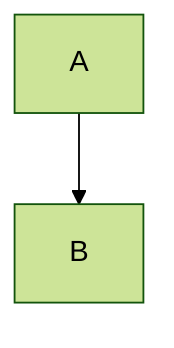
*   可用主题：`default`, `base`, `dark`, `forest`, `neutral`.

### 0.2 自定义样式与布局 (Custom Config)

*   `curve` 选项：`basis` (平滑), `linear` (直线), `stepAfter` (阶梯线)。

---

## 1. 流程图 (Flowchart) - 逻辑可视化的核心

### 1.1 方向与节点形状
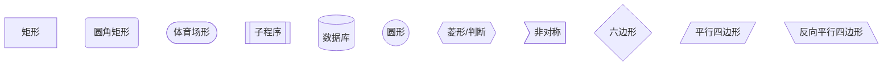

### 1.2 连线样式 (Links)
- `-->` 实线箭头
- `---` 实线无箭头
- `-.->` 虚线箭头
- `==>` 粗实线箭头
- `-- text -->` 带标签的实线
- `-. text .->` 带标签的虚线
- `== text ==>` 带标签的粗线

### 1.3 子图 (Subgraphs) & 嵌套
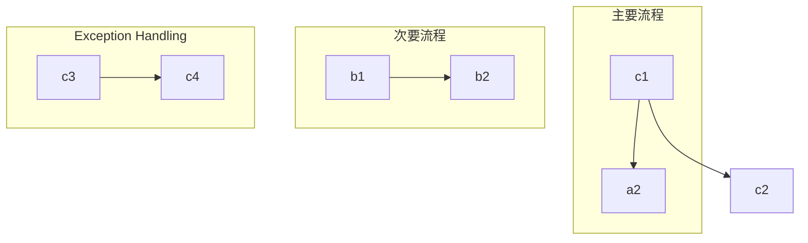

### 1.4 高级样式与图标 (Class & Styles)
**Tip**: 使用 `classDef` 定义样式类，批量应用样式。

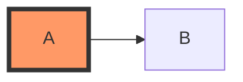

---

## 2. 时序图 (Sequence Diagram) - 交互与生命周期

### 2.1 核心语法
- `participant`: 定义参与者（控制顺序）。
- `actor`: 定义小人形状参与者。
- `activate`/`deactivate` (或 `+`/`-`): 控制生命线激活块。

### 2.2 消息类型
- `->` 实线无箭头
- `->>` 实线箭头 (同步调用)
- `-->` 虚线无箭头
- `-->>` 虚线箭头 (返回消息)
- `-x` 实线箭头加叉 (异步丢失)

### 2.3 逻辑控制块 (Fragments)
支持 `alt` (if/else), `opt` (if), `loop` (for/while), `par` (并行), `critical` (临界区)。

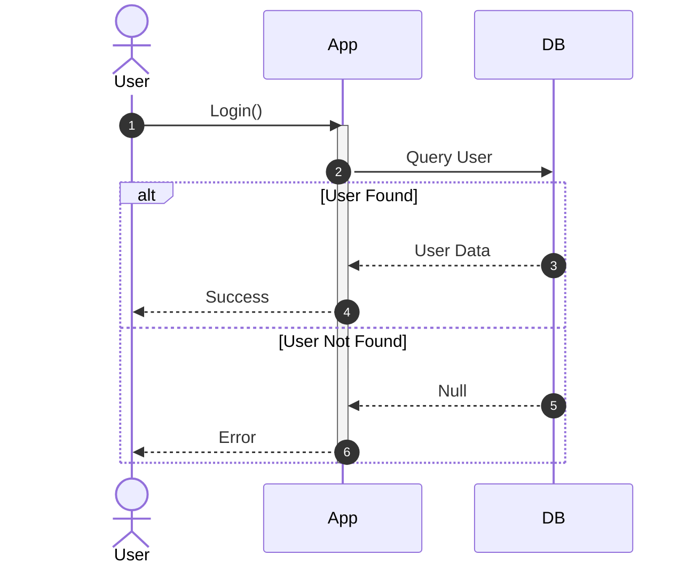

---

## 3. 类图 (Class Diagram) - 架构设计

### 3.1 关系符号
- `<|--` 继承 (Inheritance)
- `*--` 组合 (Composition)
- `o--` 聚合 (Aggregation)
- `-->` 关联 (Association)
- `..>` 依赖 (Dependency)

### 3.2 成员可见性
- `+` Public
- `-` Private
- `#` Protected
- `~` Package/Internal

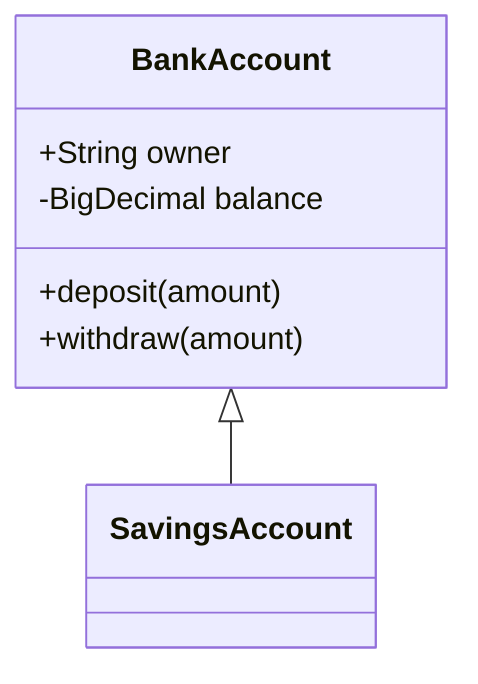

---

## 4. 状态图 (State Diagram v2) - 状态机

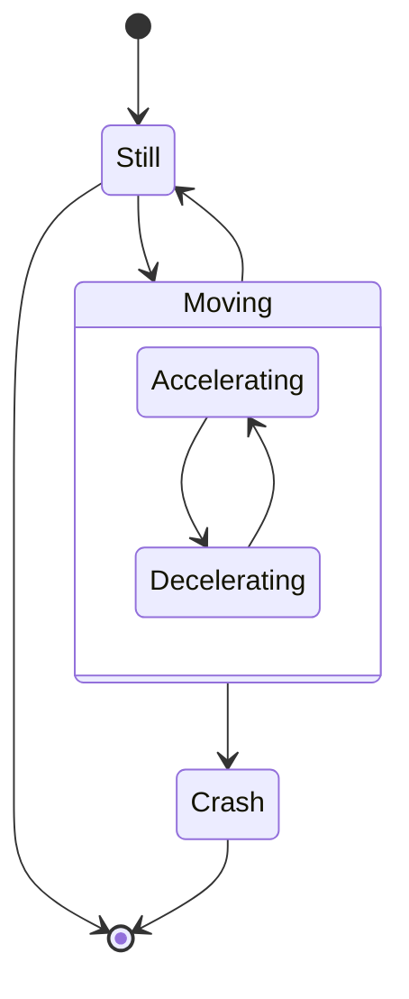

---

## 5. 实体关系图 (ER Diagram) - 数据库建模

符号含义：
- `||` : 1
- `|{` : 1..n
- `}|` : 0..n
- `o|` : 0..1

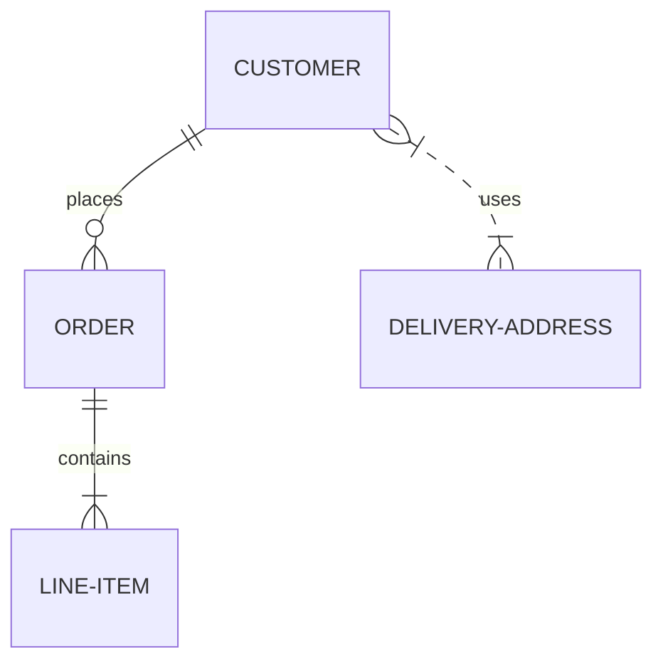

---

## 6. 甘特图 (Gantt) - 项目管理

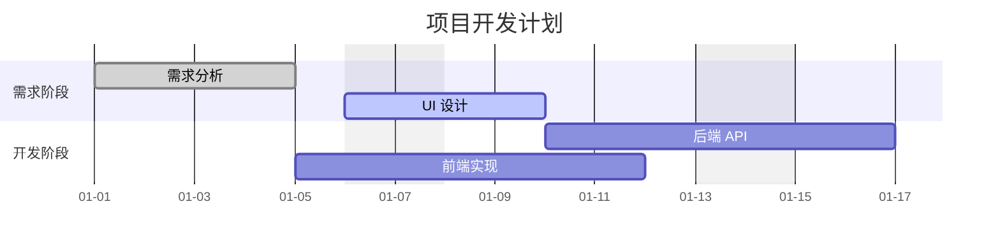

---

## 7. 思维导图 (Mindmap) - 2024 新特性

使用缩进语法来表示层级，支持图标。

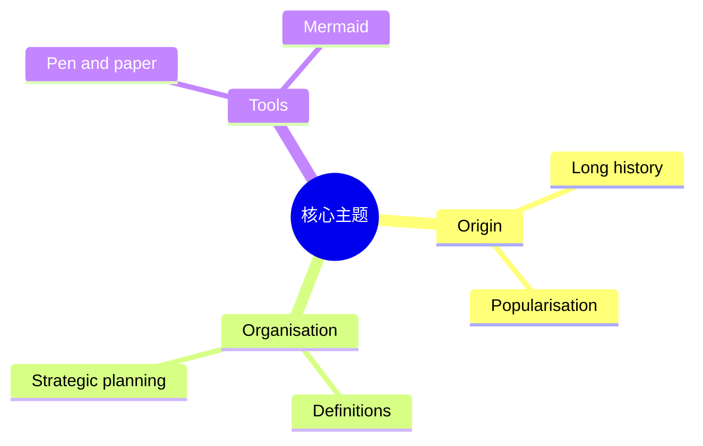

---

## 8. 时间轴 (Timeline)

类似于甘特图，但更侧重于历史事件的叙述。

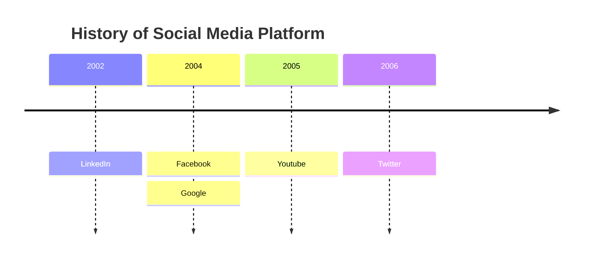

---

## 9. 象限图 (Quadrant Chart)

用于分析 SWOT 或 优先级排序 (Eisenhower Matrix)。

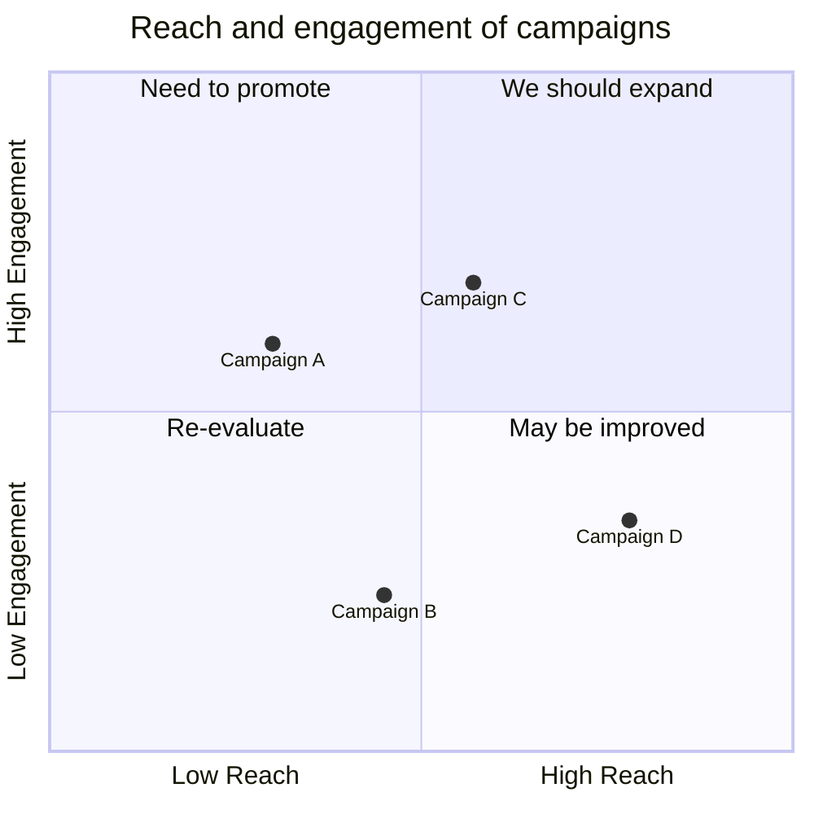

---

## 10. 饼图 (Pie Chart)

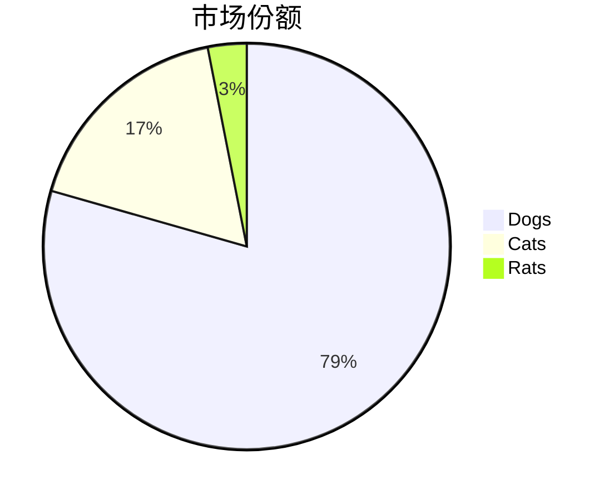
