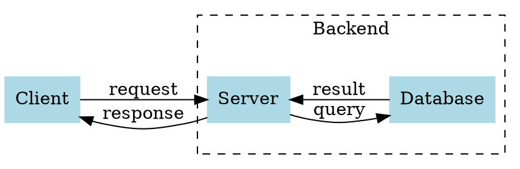

# 可视化图表使用指南 (Visualization Charts Guide)

Editor Pro 现已集成三种强大的可视化图表渲染器：**Vega-Lite**、**Graphviz** 和 **ECharts**。

## 开启功能

这些功能默认关闭。请前往 **Settings → Editor Pro → 可视化** 开启所需渲染器：

- **开启 Vega-Lite 统计图表**
- **开启 Graphviz 关系图**
- **开启 ECharts 交互图表**

> **注意**：开启或关闭渲染器后，建议重新加载插件（或重启 Obsidian）以确保更改生效。

## 1. Vega-Lite (统计/评估图表)

适合发表与对比分析，如性能趋势、分布图、热力图等。

### 示例代码

```vega-lite
{
  "$schema": "https://vega.github.io/schema/vega-lite/v5.json",
  "description": "A simple bar chart with embedded data.",
  "data": {
    "values": [
      {"a": "A", "b": 28}, {"a": "B", "b": 55}, {"a": "C", "b": 43},
      {"a": "D", "b": 91}, {"a": "E", "b": 81}, {"a": "F", "b": 53},
      {"a": "G", "b": 19}, {"a": "H", "b": 87}, {"a": "I", "b": 52}
    ]
  },
  "mark": "bar",
  "encoding": {
    "x": {"field": "a", "type": "nominal", "axis": {"labelAngle": 0}},
    "y": {"field": "b", "type": "quantitative"}
  }
}
```

## 2. Graphviz (关系/结构图)

适合绘制模块依赖、流程图、DAG、代码/服务拓扑。使用 DOT 语言。

### 示例代码



## 3. ECharts (交互 & 流量可视化)

适合桑基图、时间线、漏斗图等复杂交互图表。

### 示例代码

```echarts
{
  "title": {
    "text": "ECharts 入门示例"
  },
  "tooltip": {},
  "legend": {
    "data": ["销量"]
  },
  "xAxis": {
    "data": ["衬衫", "羊毛衫", "雪纺衫", "裤子", "高跟鞋", "袜子"]
  },
  "yAxis": {},
  "series": [
    {
      "name": "销量",
      "type": "bar",
      "data": [5, 20, 36, 10, 10, 20]
    }
  ]
}
```

## 常见问题

- **渲染失败？** 请检查代码块内的 JSON 格式是否正确（特别是逗号和引号）。
- **主题适配？** 目前图表背景通常为透明或白色，部分图表可能需要手动配置颜色以适配深色模式。
