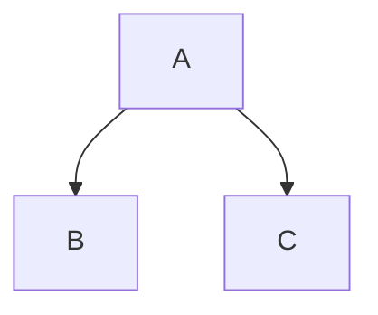

# Editor Pro 使用指南 (User Guide)

欢迎使用 Editor Pro！本指南将带你全面了解如何从零开始打造你的终极写作工作流。

---

## 目录 (Table of Contents)

1.  [快速开始 (Quick Start)](#1-快速开始-quick-start)
2.  [仪表板 (Homepage)](#2-%F0%9F%8F%A0-仪表板-homepage)
3.  [结构守护 (Vault Guardian)](#3-%F0%9F%9B%A1%EF%B8%8F-结构守护-vault-guardian)
4.  [智能写作 (Smart Writing)](#4-%E2%9C%8D%EF%B8%8F-智能写作-smart-writing)
5.  [命令菜单 (Slash Commands)](#5-%E2%9A%A1-命令菜单-slash-commands)
6.  [可视化图表 (Visualization)](#6-%F0%9F%93%8A-可视化图表-visualization)
7.  [效率增强 (Productivity)](#7-%F0%9F%9B%A0%EF%B8%8F-效率增强-productivity)
8.  [MCP 智能服务](#8-%F0%9F%A4%96-mcp-智能服务)

---

## 1. 快速开始 (Quick Start)

安装插件后，请并在设置中选择一个预设模式 (Setting Preset)：

*   🎯 **Minimal (极简)**: 仅启用核心快捷键，不改变 Obsidian 原生体验。
*   ✍️ **Writer (写作)**: (推荐) 启用专注模式、智能输入和仪表板。
*   ⚡ **Power (全能)**: 开启所有功能，包括图表渲染和脚本。

---

## 2. 🏠 仪表板 (Homepage)

仪表板是你的 Obsidian 启动站，每次打开软件或点击侧边栏 "Home" 图标时显示。

### 核心模块
*   **Greeting**: 显示当前的日期、时间和贴心的问候。
*   **Pinned Notes (置顶笔记)**:
    *   **添加/移除**: 在文件列表右键点击任意笔记，选择 "Pin to Homepage" 或 "Unpin from Homepage"。
    *   **用途**: 放置最常用的索引页或当前正在进行的长期项目。
*   **Workflow Flow**:
    *   **Inbox**: 显示 `Inbox/` 目录下的文件数。
    *   **Working**: 显示最近编辑过的 5 个文件。
*   **Reminders**: 智能检测需要清理的目录（如 Inbox 超过 10 个文件）。

### 设置
在插件设置中，你可以自定义：
*   **显示/隐藏模块**：按需开启 Pin、Recent、Reminder 等部分。
*   **追踪文件夹**：配置要在首页显示的特定文件夹（如 `Projects/`）。

---

## 3. 🛡️ 结构守护 (Vault Guardian)

Vault Guardian 帮助你维持文件结构的整洁，防止"熵增"。

### 功能说明
*   **Root Guard**: 当你在根目录创建新文件或文件夹时，如果不在白名单中，Guardian 会发出警告或阻止创建。
*   **Folder Rules**:
    *   你可以限制某个目录（如 `Inbox`）**不可以**包含子文件夹。
    *   你可以限制目录最大深度（如 `Projects` 最多 2 层）。
    *   你可以强制子目录命名规范（如 `Daily` 下只能是 `YYYY-MM`）。

### 健康检查 (Health Check)
使用命令 `Vault Guardian: Run Health Check`，可以扫描整个仓库，列出主要违规项（如根目录文件杂乱、目录嵌套过深）。

---

## 4. ✍️ 智能写作 (Smart Writing)

### Magic Input (魔法输入)
在编辑时自动转换常用符号（输入后立即生效）：
*   `->` 变为 `→`
*   `!=` 变为 `≠`
*   `(c)` 变为 `©`
*   `@today` 变为 当前日期 (YYYY-MM-DD)
*   `@now` 变为 当前时间 (HH:mm)

### Smart Typing (智能排版)
*   **自动空格**: 输入中文和英文之间时，自动插入空格（如 `Hello你好` -> `Hello 你好`）。
*   **符号配对**: 输入 `【` 自动补全 `】`，输入 `《` 自动补全 `》`。
*   **智能选择**: 选中文字后按符号键（如 `(`），会自动用括号包裹选中文本。

---

## 5. ⚡ 命令菜单 (Slash Commands)

在编辑器开头（或空格后）输入 `/` 即可呼出增强菜单：

*   `/callout` 或 `/warn` ...: 快速插入 Callout。
*   `/table`: 插入 3x3 表格。
*   `/mermaid`: 插入 Mermaid 流程图代码块。
*   `/date`: 插入日期。
*   `/daily`: 插入今日日记模板。

---

## 6. 📊 可视化图表 (Visualization)

直接在代码块中使用以下语言，即可渲染图表：

### Mermaid


### ECharts
```echarts
{
  "xAxis": { "type": "category", "data": ["Mon", "Tue", "Wed"] },
  "yAxis": { "type": "value" },
  "series": [{ "data": [820, 932, 901], "type": "line" }]
}
```

### Infographic (信息图)
```infographic
type: banner
icon: 🚀
title: Project Launch
value: 85%
color: #4caf50
```

---

## 7. 🛠️ 效率增强 (Productivity)

### Focus Mode (专注模式)
*   **开启**: 命令 `Toggle Focus Mode`。
*   **效果**: 高亮当前光标所在的段落，淡化其他段落，让你专注于当前思路。

### Typewriter Mode (打字机模式)
*   **开启**: 命令 `Toggle Typewriter Scroll`。
*   **效果**: 保持光标始终垂直居中，你的视线无需上下移动。

### 快捷键 (Keyshots)

以下是 Editor Pro 预设的、符合通用习惯的快捷键：

| 功能 | Mac | Windows/Linux | 说明 |
| :--- | :--- | :--- | :--- |
| **行上移** | `Opt + ↑` | `Alt + ↑` | 快速移动当前行或选区 |
| **行下移** | `Opt + ↓` | `Alt + ↓` | 快速移动当前行或选区 |
| **复制行** | `Cmd + D` | `Ctrl + D` | 向下复制当前行或选区 |
| **删除行** | `Cmd + Shift + K` | `Ctrl + Shift + K` | 删除当前行（VS Code 习惯） |
| **纯文本粘贴** | `Cmd + Shift + V` | `Ctrl + Shift + V` | 清除格式粘贴 |
| **多光标** | `Alt + Click` | `Alt + Click` | 在点击处添加光标 |

---

## 8. 🤖 MCP 智能服务

Editor Pro 内置了 MCP (Model Context Protocol) 客户端，允许你连接本地或远程的 AI Agent 服务。

*   **配置**: 在设置 -> MCP Server 中配置 Endpoint。
*   **使用**: 插件会自动通过 MCP 将你的笔记上下文提供给 AI，实现智能问答或操作。

---

*Editor Pro - 写作，从未如此顺滑。*
