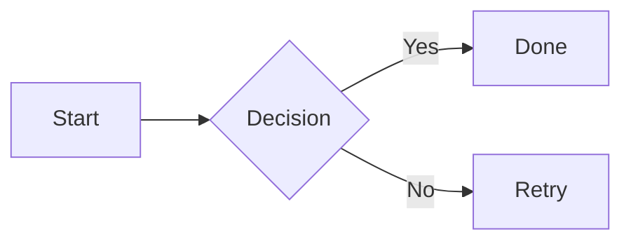
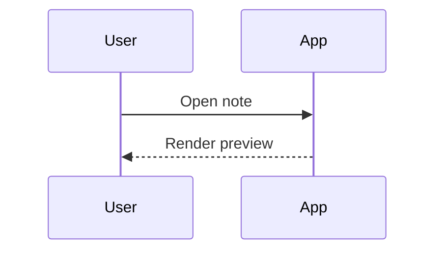
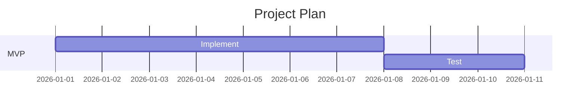

# 画图语法参考（Mermaid / D2 / Infographic）

本插件的目标是支持“AI 生成 → 插入代码块 → Obsidian 预览渲染”的工作流。本文整理常用画图语法，便于后续喂给 AI 作为输出参考。

## 1) Mermaid（Obsidian 原生支持）

### 1.1 基本用法

```md

```

### 1.2 常见类型（示例）

**Sequence**

```md

```

**Gantt**

```md

```

### 1.3 给 AI 的输出建议
- 只输出一个 ` ```mermaid` 代码块
- 优先选择 `flowchart` / `sequenceDiagram`，结构清晰、易改
- 不要夹带额外解释文字（减少用户复制粘贴时的噪声）

## 2) D2（本插件目前仅“插入代码块”）

> 说明：Obsidian 默认不会渲染 D2。本插件目前提供 `/d2` 生成空的 ` ```d2` 代码块；后续如果要“预览渲染”，需要额外接入渲染器（需评估体积与离线策略）。

### 2.1 基本用法（示例）

```md
```d2
App -> API: request
API -> DB: query
DB -> API: rows
API -> App: response
```
```

## 3) Graph（Graphviz / DOT，本插件目前仅“插入代码块”）

> 说明：Obsidian 默认不会渲染 DOT。本插件提供 `/graph` 生成 ` ```dot` 代码块骨架；如果你安装了 Graphviz 渲染类插件/主题扩展，可在预览里看到效果。

### 3.1 基本用法（示例）

```md
```dot

```
```

## 4) Infographic（AntV Infographic，本插件支持预览渲染）

> 说明：本插件会在预览/阅读模式渲染 ` ```infographic` 代码块为 SVG。

### 4.1 语法骨架（必须遵守）

```md
```infographic
infographic list-row-simple-horizontal-arrow
data
  title Getting Started
  items
    - label Step 1
      desc Install dependencies
    - label Step 2
      desc Configure settings
    - label Step 3
      desc Run the app
```
```

### 4.2 语法规范（建议直接给 AI）

以下内容来自 AntV Infographic 官方语法规范（类 Mermaid 语法）：

1. 入口必须是 `infographic <template-name>`
2. 键值对用空格分隔；缩进统一 **2 空格**
3. `data` / `design` / `theme` 都是“顶层块”（与 `data` 同级，不要缩进到别的块里）
4. 对象数组用 `-`（如 `data.items`），简单数组可行内写（如 `palette #fff #000`）
5. 层级数据用 `children` 嵌套（仍在 `items` 数组里）

### 4.3 层级示例（Hierarchy）

```md
```infographic
infographic hierarchy-tree-tech-style-rounded-rect-node
data
  title Organization
  items
    - label CEO
      children
        - label Product
          children
            - label Design
            - label Engineering
        - label Marketing
        - label Sales
```
```

### 4.4 `design` / `theme`（官方示例）

```md
```infographic
infographic list-row-horizontal-icon-arrow
design
  structure default
    gap 12
  item default
    showIcon true
theme
  colorBg #0b1220
  colorPrimary #ff5a5f
  palette #ff5a5f #1fb6ff #13ce66
data
  title 客户增长引擎
  desc 多渠道触达与复购提升
  items
    - label 线索获取
      value 18.6
      desc 渠道投放与内容获客
      icon company-021_v1_lineal
```
```

### 4.5 在插件里怎么写（推荐工作流）

- `/infographic`：只插入空的 ` ```infographic` 代码块（从零写，最自由）

### 4.6 template-id 列表（B）

- 完整 template-id 列表见：`repo-docs/infographic-template-ids.md`
- 该列表的目的：帮你快速“选模板名”，不是语法必需（渲染器可以渲染所有内置模板）

### 4.7 常用 template-id（速查）

- `list-row-simple-horizontal-arrow`（流程）
- `sequence-timeline-simple`（时间线）
- `chart-column-simple`（柱状图）
- `hierarchy-tree-tech-style-rounded-rect-node`（层级树）

模板定义位置：`src/features/infographic/templates.ts`

### 4.8 渲染错误时展示什么？（你提到的点）

本插件的策略是：
- 默认展示“错误摘要”（你能立刻知道为什么没渲染出来）
- 同时提供一个可展开区域“显示源代码”（用于排查缩进/拼写问题）

这样比“完全不显示”更可控，也比“直接把源码铺满预览”更不打扰阅读。

### 4.9 官方文档

- 语法：`https://infographic.antv.vision/learn/infographic-syntax`
- 主题：`https://infographic.antv.vision/learn/theme`
