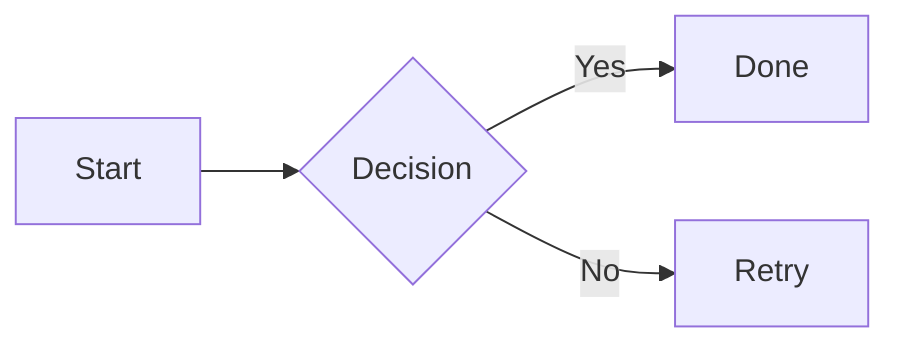
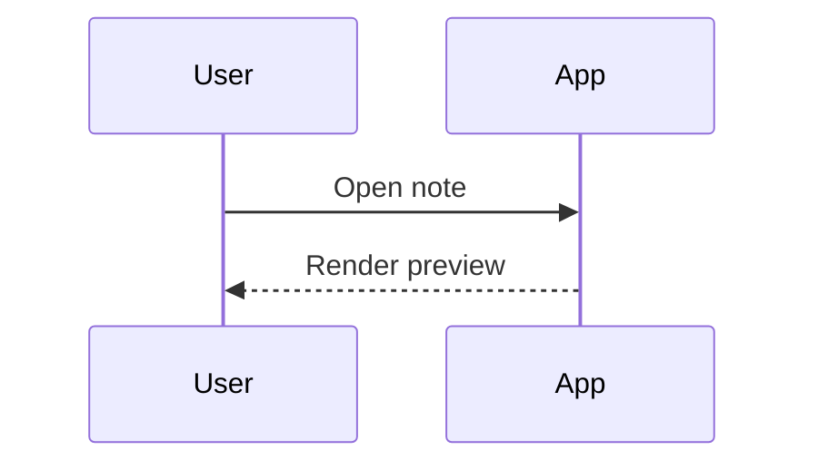
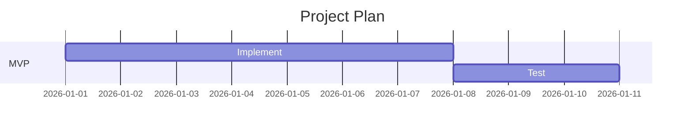
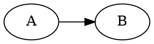

# 画图语法参考（Mermaid / D2 / Infographic）

本插件的目标是支持“AI 生成 → 插入代码块 → Obsidian 预览渲染”的工作流。本文整理常用画图语法，便于后续喂给 AI 作为输出参考。

## 1) Mermaid（Obsidian 原生支持）

### 1.1 基本用法

```md

```

### 1.2 常见类型（示例）

**Sequence**

```md

```

**Gantt**

```md

```

### 1.3 给 AI 的输出建议
- 只输出一个 ` ```mermaid` 代码块
- 优先选择 `flowchart` / `sequenceDiagram`，结构清晰、易改
- 不要夹带额外解释文字（减少用户复制粘贴时的噪声）

## 2) D2（本插件目前仅“插入代码块”）

> 说明：Obsidian 默认不会渲染 D2。本插件目前提供 `/d2` 生成空的 ` ```d2` 代码块；后续如果要“预览渲染”，需要额外接入渲染器（需评估体积与离线策略）。

### 2.1 基本用法（示例）

```md
```d2
App -> API: request
API -> DB: query
DB -> API: rows
API -> App: response
```
```

## 3) Graph（Graphviz / DOT，本插件目前仅“插入代码块”）

> 说明：Obsidian 默认不会渲染 DOT。本插件提供 `/graph` 生成 ` ```dot` 代码块骨架；如果你安装了 Graphviz 渲染类插件/主题扩展，可在预览里看到效果。

### 3.1 基本用法（示例）

```md

```

## 4) Infographic（AntV Infographic，本插件支持预览渲染）

> 说明：本插件会在预览/阅读模式渲染 ` ```infographic` 代码块为 SVG。

### 3.1 语法骨架

```md
```infographic
infographic list-row-simple-horizontal-arrow
data
  title Getting Started
  items
    - label Step 1
      desc Install dependencies
    - label Step 2
      desc Configure settings
    - label Step 3
      desc Run the app
```
```

### 3.2 重要语法规则（建议给 AI）

1. 模板名必须是有效的完整 `template-id`
2. `theme` 块必须与 `data` 同级（同缩进），不能写进 `data` 里
3. 层级类模板用 `items` 数组，子节点用 `children`
4. 统一使用 **2 空格缩进**
5. 常见字段：`label`、`value`、`desc`、`icon`、`children`

### 3.3 层级示例（Hierarchy）

```md
```infographic
infographic hierarchy-tree-tech-style-rounded-rect-node
data
  title Organization
  items
    - label CEO
      children
        - label Product
          children
            - label Design
            - label Engineering
        - label Marketing
        - label Sales
```
```

### 3.4 当前内置模板（插件模板选择器）

- `list-row-simple-horizontal-arrow`（流程）
- `sequence-timeline-simple`（时间线）
- `chart-column-simple`（柱状图）
- `hierarchy-tree-tech-style-rounded-rect-node`（层级树）

模板定义位置：`src/features/infographic/templates.ts`
